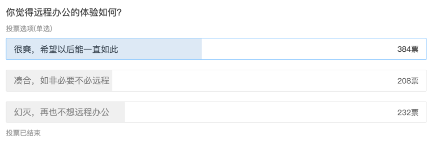

# 远程办公，会是现代公司的终局吗？

[转载](https://www.tisi.org/13467)

2020年初，一场疫情冲淡了所有人对春的喜悦。几乎没有哪个行业或哪家公司能够独善其身。

但唯有“线上办公”这一赛道，是疫情十足的受益者。上亿用户涌入了他们平时不怎么用的办公App，通过之前并不熟悉的远程在线办公来完成自己的工作。

这些工具及其背后的公司、组织与人员的坚持是可贵的，正是因为他们才使得疫情期间的许多社会与商业运作能够顺利运转。

如果我们将线上办公的应用阶段化为三个阶段，那么大概是我们日常使用互联网工具的“线上办公阶段”，此次疫情期间出现的“远程办公阶段”，以及未来可能出现的“永久远程办公阶段”。

在这次疫情期间，线上办公的应用阶段完成了一次抢跑，从我们日常的“线上办公”一次性无过渡的进入了“远程办公”阶段。

但在几个月前，上一个阶段的“线上办公”都仍然是一个毁誉参半的名词。与线上办公相伴的报道，经常与“996”联系在一起。几乎所有职场人都在控诉线上办公对个人生活空间的侵扰。

客户的一条微信，老板的一次钉钉，无论是在什么时间、在什么地点、正在做什么，你都要立刻投入到工作状态。

而比996更糟糕的是，尽管并不合法，但许多996岗位给出的基本薪酬会比非996岗位多一些，否则企业就无法招到合适的人才。而隐藏在线上办公中的加班，却几乎渗透进所有的岗位，而没有任何人因此多获得补偿。

比起996，无时无刻不在的线上办公更像是数字时代的永动机，它使得企业似乎能用8小时的钱买下我们所有的时间。

而现在，经过疫情期间这场大型试验，能让我们对线上办公得到哪些新认识？

## 疫情之后，回不去的过去

为了避免讨论陷入虚无主义，我们首先要复述一遍线上办公的好处。

线上办公的好处是毋庸置疑的，它从根本上改变了现代组织的运行效率。

在前互联网时代，组织越大内部信息的传递效率就越低，即便算上传真与电话，一个万人企业总裁办的决定，可能也需要一周的时间才能传达至全部员工。而现在，无论企业规模的大小，公司的顶级决策者甚至可以通过即时通信或直播与每一名员工立刻同步自己的决定。

从下到上的信息传递也是如此，在没有互联网的时代，每个区域的销售情况可能以月甚至以季度为单位呈现给企业的决策者。而在线上办公的时代，自动化的报表系统联动精准的进销存、库管和销售系统，可以在每日零点为企业决策者呈现前一日的市场动态。

而随着物联网和大数据技术的发展，这种趋势正在变得越来越明显，货物、贸易、交易、客流等信息都在以过去难以想象的水平实现量化、精准化、实时化。更简单易读的数据图表也把那些过去隐藏在数十年从业经验与市场判断中的玄学秘密以更为科学的方式展示出来。

在互联网的加持下，一个万人企业理论上可以像一人企业那样灵活，身居幕后的企业决策者能够获得的有效信息甚至比过去冲上一线的管理者更能察觉到市场细微的变化。

有时，我们之所以会对线上办公所带来的百倍效率优势“视而不见”，是因为我们所有人的竞争对手在工作效率上同样得到了百倍提升。无论线上办公为个人或企业带来了什么样的新问题，我们都不可能退回到非线上办公时代，理由很简单：因为我们不可能让我们的竞争对手退回到非线上办公时代。

与许多互联网产品一样，我们的社会在开始“线上办公”的时候，静默同意了一个长长的副作用列表。但没有人能停止这件事情，因此我们的讨论应该更多聚焦于如何保持其效率优势的情况下减少负面影响。

## 边界：线上办公的核心问题

线上办公的最核心问题在于边界，即生活与工作的边界，进一步说就是个体与外界的所有边界。

在2020年初的疫情发生之前，关于线上办公的问题是：因为有了即时通信工具，我失去了原本的下班时间，即便我下了班，老板和客户还是会通过网络把我带回工作场景。

在疫情发生之后，线上办公的问题是：因为我们只能通过通信工具进行沟通，我经常在上班时间联系不上我的上司、下属和同事，我根本不知道他是在专心工作还是去摸鱼了。

仅仅把这两个问题列在这里，我们就可以发现真正的问题只有一个：互联网显著打破了我们工作与生活的边界。

根据盖乐普咨询在2017年发布的《全球职场状况报告》显示，全球完全处于敬业状态（即完全不摸鱼且热爱自己的工作）的工作者只有13%。因此，这种边界的打破显然既对生活没好处，也不一定对企业有好处。

在以家庭为单位的早期手工业阶段，工作与生活界限是不分的。在工业革命时期，机器的生产效率发生了指数级的成长，并且机器是一个可以不眠不休实现生产的实体。在这个情况下，人成为了整个工厂中最为低效的那个环节。企业家为了提升整个工厂的产出量，促成了“工厂-带宿舍的工厂-不让员工外出的带宿舍的工厂”等形态。这时，工作与生活的边界才被清晰的划定，并且工作的边界硬的像一堵移动墙，不断向着生活空间的那一端挤压。

然而，不可避免的一个客观现实是，人类永远不可能完全异化成流水线上的一个完美齿轮。无论多么苛刻的工厂主都明白，工人也都需要休息，而机器却永远不需要。随着工人阶级的抗争，企业找到了更符合客观规律，也能够满足工人个人需求的方法：轮班制，通过让人休息，机器不休息的方法暂时平息了这一客观上存在的矛盾。

回到当下，互联网带来效率上的百倍提升，是这一矛盾再次爆发的一个重要原因。

如今的“机器”，不再是指某一个生产车间中物理的流水线，而是指除了个人以外的整个商业社会。在过去，二十四小时不停业的商店、餐饮、媒体、文化娱乐场所、学校和医院占经济活动的少数，人们按照工业革命以来所形成的昼夜节律进行作息，只在刚性划定的劳动时间边界上有些局部战争。

现在，所有商业行为都是24小时不停业，我们有了电商、外卖、新媒体、线上游戏与视频、在线教育和线上医疗等等业态，它们中的许多业务全年无休，全球化更让我们每个人工作所服务的对象不再局限于一个时区。

当某一个体上了一天班，准备卸下劳动者标签换上消费者标签的时候，他的需求被抛入一个巨大的机器中，经过层层路由成为了另外一个人在休息时间紧急接到的远程加班需求。

在此前反对996的声音中，我们得知的一个普遍情况是，当规定工作时间被无意义拉长，员工的效率反而会降低。

具体来说，如果企业采用正常的工作时间，并且遵循常理“手头工作没做完，要稍微加一会儿班”，那么员工就会为了能够整点下班而尽量提升自己在工作时间中的效率。

但现在线上办公所带来的问题是：你永远无法预测“事儿”在什么时间点袭来。

部分企业因业务下滑而要求996，在某种程度上与工业革命时期工厂主试图让工人不眠不休跟上机器的节奏是一样的。无论法律是否制裁，这种模式最终都会把企业带向更糟糕的结果，因为它是反客观规律的。

因此，既然已知我们无法回到那个没有网络参与我们工作与生活的时代，那么我们唯一可能的解决方案就是：彻底打破边界，并通过配套的模式适应这种新的客观现实。

## 线上办公的深层次矛盾

我们在未来是否会有更多的永久线上办公？

这其实是个不严谨的命题，因为它受到线上办公技术体验这一变化因素的影响。

如果技术在未来10年发展出如科幻电影一般的沉浸式VR体验，并且其成本也使得绝大多数企业可以投资得起，届时的企业将没有理由不接纳远程办公，并因此节省大量的物业与行政成本。

但在某种程度上，远程办公的体验并没有我们想象中进化的那么快。更激进的一点说法是，在过去5年远程办公的工具并没有本质上的进化。类似腾讯文档和石墨文档的文档协作工具，最早诞生于2006年；与企业微信、钉钉相似的Slack上线于2013年；TAPD、Teambition等在线项目管理类的工具也早在2010年前后就爆发过一波。

因此，我们在讨论这个问题的时候，首先应当锚定住这个变化因素，即假定以现在的远程办公条件，永久线上办公是否会成为趋势。

直觉上，我的答案是否定的，但真实情况可能相反——我们会迎来越来越多的永久在线、远程办公。

2020年发生的这次疫情，刚好是一次远程办公的模拟。3月11日左右，也就是许多人因为疫情而开始远程办公的一个月左右，微博上有一个小投票，结果如下：

其中认为远程办公完全无法接受的只占到28.1%，这似乎与网络上铺天盖地的对远程办公的吐槽并不相符。再考虑到此次疫情是突然发生，大部分企业此前没有能够建立科学的远程办公机制，能有如此评价似乎已是超出预料。

疫情期间的远程办公显然会更明显的打破生活与工作的边界，但它与我们此前经历的“线上办公”阶段，企业刚性要求员工8小时工作制，又额外在休息时间让员工随叫随到是完全不同的——这一次，老板依然会在晚上9点下需求，但员工也可以在下午3点追剧。

因此，在疫情期间，我们反而经常听到的一个关于线上办公的抱怨是来自企业管理者的：“我怎么知道员工在家里在干活儿？”

这是疫情期间许多企业中层或高层管理者对企业内部的焦虑来源，这种压力也一定程度通过无尽的表格填写、视频汇报传导到了普通员工的身上，并据此形成了“永久在线办公不现实”的主观印象。

但实际上，这只是问题的表象，它恰恰暴露了部分企业在日常管理中没能建立有效的沟通机制、清晰的战略目标和稳定的工作流程。

用更通俗的话来说，就是员工需要做什么是没谱的，完全需要上级每日的“政令”；领导了解员工的工作成果也是没准的，主要靠打卡记录甚至目视员工在岗。

抛开远程办公和特殊时期不谈，这样的企业本身就无法经受时间的考验，会在长期竞争中落败给那些内部管理更为优秀的企业。

除去受到致命直接影响的企业（如服务业），疫情某种程度上是一次加速淘汰，它让那些原本做得好的企业验证了自己的模式，让那些原本就在走钢丝的企业爆发危机。

因此，经过此轮的远程办公的大型实践，一定有越来越多的对工时管理不敏感的企业和行业开始尝试将远程办公纳入自身管理的一部分。

工时管理的理念源自于第一次工业革命所产生的“工厂”这一形态，它革命性的切割了工人用于生产活动的时间和生活休闲的时间，并在第二次工业革命中确立为工业社会的主要劳动力管理方式。马克斯·韦伯在1904年发表的《新教伦理与资本主义精神》引用美国第一任总统本杰明·富兰克林的话“时间就是金钱”来论证基于劳动时间的工作制度，是资本主义精神的本质。

在那个黑暗的时代，资本家利用秒表计算工人产出每一个零件的精确时间，然后再用工时和产量两头衡量员工——如果你在规定的时间内没有完成足量的零件，证明你偷懒；如果你完成了足够多数量的零件却提前下班，意味着你成为了熟练工，可以领取微薄的涨薪，然后迎来更高的绩效指标。

在过去300年间的大部分时间段和大部分领域中，这都是正确的。但随着信息时代的来临，现代职场不再完全以制造业为中心，工时与产出的正相关性正在变得越来越低。

但在过去的半个世纪中，随着第三产业（服务业）和第四产业（技术与用户体验）的发展，除了让消费端产生了永不停业的需求，也让劳动力构成正在发生巨大的变化。

企业仍然需要购买劳动力，但劳动时间不再是劳动要素中的一个必要元素。一个方案、一个观点、一个信息、一套方法论、一个创意、一个设计、一个关系链所产生的价值可能远高于一个员工一年的劳动时间所创造出的价值。

与原子经济不同，这些基于信息的劳动要素是可以被复用的，更加适应于永久远程办公。

一个明显的例子，在中国的新媒体行业，其实存在一个庞大且独立的渠道运营外包群体。这个群体中有小型机构企业，也有个人。他们的主要服务，就是帮助品牌或内容机构每日对公号进行排版、回复平台留言、处理不同平台的认证续期等。

这种工作一般在企业内被划为“基础性劳动”，但事实上它又没有那么基础。企业聘用一个熟练且具备学习能力的新媒体运营，需要支付较高的薪酬，但除非企业拥有很多个品牌需要运营，否则这名员工的大部分规定在岗时间无法被足够的工作量填充。

在远程外包模式下，一个熟练的新媒体运营者可以在同一个时期内代运营5到8个账号，并有时间学习最新的运营技巧以保持自己的竞争力。在这个过程中，这一拥有熟练技巧的运营者收入会显著上升，而每个企业在获得同等运营水平的情况下，支出却大幅度减少。

## 大趋势：未来的人与公司

现代企业的目的不是为了将一群人困在格子间里8~12小时，正相反，如果一名员工能够在不使用公司的办公室和其它生产资料的情况下为公司创造价值，那公司应该为此高兴才对。这才是SOHO（在家办公）、BYOD（自带设备工作）和外包开始在世界范围内流行的原因。

兼职、自由职业和自雇的兴起也会在未来加速这一过程。企业不开放远程办公，在客观上其实并不能阻止自己的员工在业余时间发展第二份自由职业，却只能阻止自己从社会上吸收有能力的自由职业或远程工作者为企业创造价值。

在企业管理层面，OKR（目标与关键成果法）逐渐流行与KPI（企业关键绩效指标）的式微也证明了这一点。与KPI相比，OKR强调企业中的每一个人都清晰了解整个企业的战略目标是什么，并且可以依据这个目标更加灵活的协调自己为了达成这一目标的具体路径。

在KPI模式下更容易出现为加班而加班的情况，因为员工的“关键绩效”之一可能就是工作时长。而“工作时长”在一个正确的OKR计划中是不应该出现的，除非有科学的证据证明“增加工作时长”这个KRs（关键成果）与“增加销量”或“增加公司收入”这个O（目标）有直接相关性。

当然，OKR并不是完美的，因为它依然专门为企业内部常设岗位的员工所设计。未来，可能会诞生一个能够更好的兼容永久远程办公和大量兼职员工的企业管理工具。

而如果一个企业以实现自身价值为导向进行内部管理，并且信息工具足以支撑其内部沟通，那么员工在哪办公和什么时间办公就不再是企业管理者需要加之束缚的问题。

在本文第一节所描述的理想的“线上办公”中，一个极端情况下完美的企业其实不需要齿轮型的员工。在卓别林《摩登时代》中所展现的被异化为齿轮的工人，将彻底被真正的齿轮（AI）所替代。

但相对的，我们会对创造性人才产生更多的依赖。因为，凡是可被齿轮驱动的机器，也都可以被量产和淘汰，只有人这一元素本身才是让一家公司维持其独特竞争力的最重要因素。

怎样能抓住那些人才的心？俗话说得好，“钱多，事少，离家近”。永久远程办公，就是“离家近”这个要素的终局。
